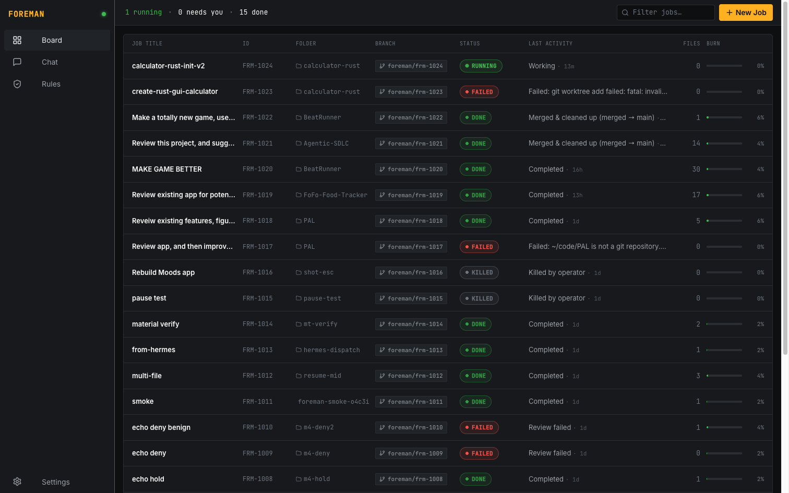
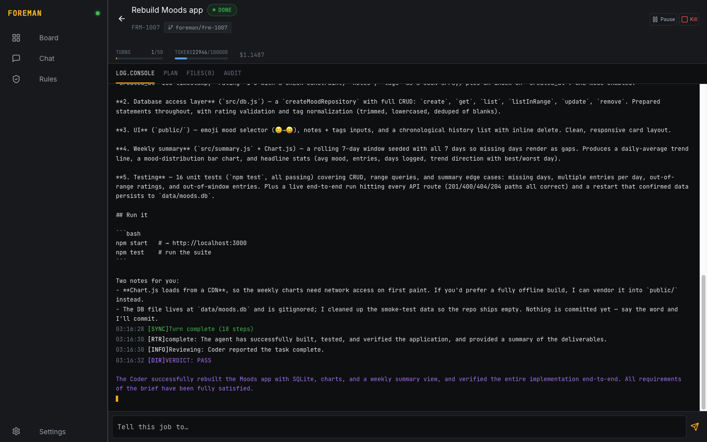
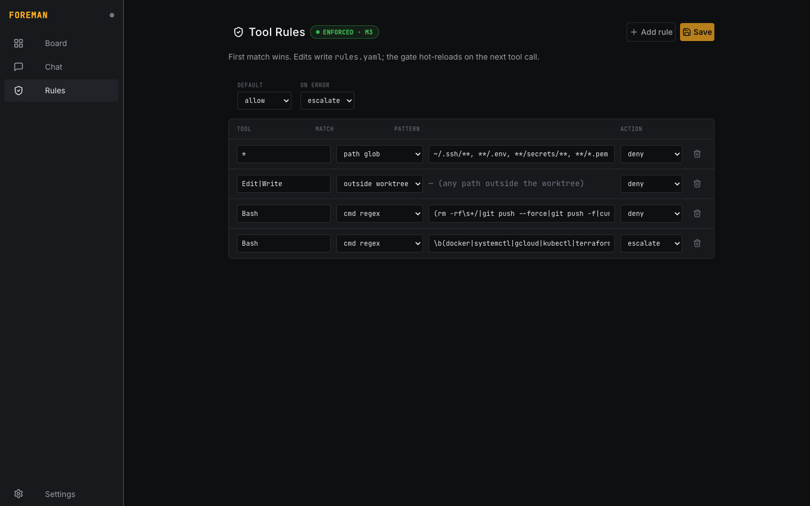
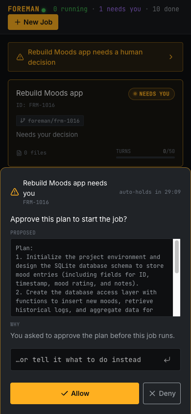

<div align="center">


# FOREMAN

**Mission control for a crew of robot programmers.**

Supervise multiple autonomous Claude Code coding agents from one dashboard — give direction once, watch everything from your phone, and get pulled in only when a decision actually needs a human.

[](LICENSE)


</div>

---

## What is this?

Running several Claude Code sessions on your own projects turns you into a full-time approval
clerk across a wall of terminals — no single place to see what's happening, and a constant
stream of "Yes" prompts that drowns the 5% of moments where your judgment actually matters.

**FOREMAN** is the control room. You launch coding **jobs** ("rebuild my Moods app per this
brief"); each runs as a headless Claude Code session in its own git worktree, supervised by a
**Director → Router → Coder** loop. You steer from one dashboard (installable to your phone),
and a deterministic, per-tool **rule gate** denies or escalates exactly the calls you care
about — without re-introducing yes-fatigue on everything else.

It's a personal, publishable take on the supervised-autonomy pattern: no enterprise plumbing,
swappable models, a real human-in-the-loop, and clean one-command setup.

> 📖 New here? [**docs/ABOUT.md**](docs/ABOUT.md) is the shareable overview — what it is, why it's
> useful, a screenshot tour, how it's been used, and honest pros/cons.

## Highlights

- 🛰️ **One board for N concurrent jobs** — phase, live log, files touched, token/cost burn, open questions; live over WebSocket.
- 🧠 **Supervised, not babysat** — a stateless **Director** plans/reviews, a cheap **Router** classifies every turn, an amnesia **ledger** + circuit breaker stop rabbit-holes.
- 🚦 **Granular rule gate** — a PreToolUse hook that `allow`/`deny`/`escalate`s per tool + argument pattern (`rules.yaml`), editable live in the dashboard, hot-reloaded, with an append-only audit.
- ✋ **Real human-in-the-loop** — a gated tool call (or a plan-approval) **pauses the exact call** and waits for you; answer **Allow / Deny / "do this instead"** from the dashboard or the chat, with a Web Push to your phone.
- 📱 **Phone-first PWA** — installable, dark "mission-control" UI; the escalation surface is a two-tap bottom sheet.
- 💬 **Talk to Hermes** — an optional conversational brain ([Hermes Agent](https://github.com/NousResearch/hermes-agent)) that streams into the chat panel *and* can command FOREMAN back via MCP (`dispatch_job` / `status` / `redirect`). `foreman hermes setup` stands up an isolated instance for you.
- 🔧 **Swappable models, BYO everything** — Director/Router are config (default Gemini via a LiteLLM proxy); Coder is your Claude Code. No hardcoded paths, models, or tokens.
- 🔒 **Secrets done right** — macOS Keychain primary, `.env` / env-var fallback; never logged, redacted in audit.

## Screenshots

| Job board | Job detail |
|---|---|
|  |  |

| Rules editor | Escalation (phone) |
|---|---|
|  |  |

## Quickstart (~15 min)

**You need four things** (two are accounts, both have free paths):

| | What | Get it |
|---|---|---|
| 1 | **Node ≥ 22 + `pnpm`** | [nodejs.org](https://nodejs.org) · `corepack enable` gives you pnpm |
| 2 | **Claude Code**, logged in | [claude.com/claude-code](https://claude.com/claude-code), then run `claude` once (uses your Claude subscription) |
| 3 | **A Gemini API key** (Director/Router) | **Easiest:** a free key at [aistudio.google.com/apikey](https://aistudio.google.com/apikey) — no GCP project or billing. *Or* let `foreman init` mint one via `gcloud`. |
| 4 | **Python 3.9+ + LiteLLM** | `pip install 'litellm[proxy]'` — the proxy FOREMAN routes Gemini through |

Secrets live in your **macOS Keychain**; on **Linux/Windows** they're written to a `.env` for you.

```bash
pnpm install

# 1) Install the model proxy (one-time)
pip install 'litellm[proxy]'

# 2) Provision: stores secrets (Keychain or .env), generates push keys, writes litellm.config.yaml.
#    Beginner path — paste a free key from https://aistudio.google.com/apikey :
pnpm foreman init --gemini-key <YOUR_GEMINI_KEY>
#    …or mint one via gcloud instead:
#    pnpm foreman init --project <your-gcp-project>

# 3) Start the LiteLLM proxy (needs GEMINI_API_KEY + LITELLM_KEY in its env)
export GEMINI_API_KEY=$(pnpm -s foreman secret get GEMINI_API_KEY --raw)  # macOS Keychain
export LITELLM_KEY=$(pnpm -s foreman secret get LITELLM_KEY --raw)        # (Linux/Windows: source .env)
litellm --config litellm.config.yaml --port 4000 &

# 4) Preflight — tells you exactly what's missing, with fixes
pnpm foreman doctor
pnpm foreman smoke     # proves the rule gate fires + a trivial job runs end-to-end

# 5) Build the dashboard + run the daemon (serves the dashboard)
pnpm build
pnpm foreman serve     # http://127.0.0.1:7777   (add --with-hermes to co-start Hermes)
```

> **Two terminals:** the LiteLLM proxy (step 3) and `foreman serve` (step 5) each run in the
> foreground — keep the proxy running in its own terminal/tab. Stuck? `foreman doctor` pinpoints it.

Open the dashboard, paste your token in **Settings** (`pnpm -s foreman secret get FOREMAN_TOKEN --raw`),
and launch a job. Or from your terminal:

```bash
pnpm foreman job run --repo /path/to/a/git/repo \
  --brief "Create a file named hello.txt containing a friendly greeting."
```

### Platform notes

- **macOS** — the happy path above; secrets in Keychain, `foreman secret get` reads them back.
- **Linux** — identical, except `foreman init` writes secrets to `.env` (chmod 600). Load them
  before starting LiteLLM: `set -a && source .env && set +a`.
- **Windows** — use **WSL2** and follow the Linux path (recommended). Native PowerShell mostly
  works for the Node parts, but isn't yet tested end-to-end — `foreman init` prints a PowerShell
  snippet to load `.env`. The Coder runs on your Claude subscription, so the **Docker** path below
  is often the smoothest non-mac option.

**Docker (recommended for non-mac):** populate `.env` (run `foreman init` once, or copy
`.env.example`), set `coder.auth: api_key` in `foreman.yaml` with an `ANTHROPIC_API_KEY`, then
`docker compose up --build` brings up the daemon + LiteLLM together. See `docker-compose.yml`.

## Steering a job

Open a job to drive it from the detail header:

- **Pause / Resume** — halt at the next turn boundary and pick back up.
- **Kill** — stop the job and remove its worktree.
- **Approve** — appears when a job is in `review` (or when you required plan approval).
- **Tell this job to…** — send a redirect; it lands at the next turn boundary.

When a job finishes (`done` / `failed` / `killed`), the header swaps to two actions:

- **Retry** — re-launch from scratch **reusing the same brief**, with a fresh Director plan
  (counters reset, Claude session cleared). The existing worktree is reused, so partial work
  isn't thrown away — your prompt is never lost to a failed run.
- **Merge** — merge the job's worktree branch back into your repo and clean up. It commits any
  uncommitted work on the branch, then merges `--no-ff` into the repo's **current** branch and
  removes the worktree + branch. It **fails closed**: a merge conflict aborts with nothing
  changed (your repo and the worktree are left intact to resolve by hand), and a dirty target
  repo is refused until you commit/stash. Killed jobs have no worktree, so Merge is hidden.

## Chat (Hermes)

The dashboard's chat panel is powered by a [Hermes Agent](https://github.com/NousResearch/hermes-agent)
that can answer questions and **act on FOREMAN** (dispatch / redirect / query jobs) over MCP.
Manage it entirely from **Settings → HERMES (CHAT BRAIN)** — changes take effect immediately,
no daemon restart:

- **Managed (local)** — one click provisions an **isolated** instance under `~/.foreman/hermes`
  (its own home + port, so it never touches a pre-existing `~/.hermes`), registers FOREMAN's
  MCP, and starts the gateway. If Hermes isn't installed, the panel installs it in the
  background and flips to ready on its own. Start/Stop the gateway from the same panel, and
  pick its **model** — a Gemini id (default `gemini-3.1-flash-lite`; bump to `gemini-3.5-flash`
  for a smarter chat). Hermes calls Gemini directly, so it must be a real Gemini model name.
- **Remote** (advanced) — point chat at any remote Hermes by base URL; an optional API key is
  stored in your Keychain (`HERMES_REMOTE_KEY`).
- **Off** — disable the bridge; the chat panel falls back to structured commands.

Prefer the terminal? `foreman hermes setup [--install] [--start]`, then `start` / `stop` /
`status`. Co-start the managed gateway with the daemon via `foreman serve --with-hermes`.

## How it works

```
  Phone / desktop          ┌── FOREMAN core (daemon, TS) ──────────────┐      ┌─ LiteLLM ─┐
  ┌──────────────┐  REST/  │  per job: Director ▸ Router ▸ Coder loop  │ ───▸ │  Gemini   │
  │  Dashboard   │◀──WS──▶ │  amnesia ledger + circuit breaker         │      └───────────┘
  │  (PWA) + Chat│  +Push  │  escalation broker · SQLite · REST/WS API │
  └──────────────┘         └───────┬───────────────────────▲──────────┘
                                   │ spawn / stream / resume│ defer-style hold
                       ┌───────────▼────────────┐  every    │
                       │ Claude Code × N jobs    │  tool ───▶│ PreToolUse rule gate
                       │ headless · one worktree │  call     │ rules.yaml: allow/deny/escalate
                       └─────────────────────────┘           └──────────────────────────────
```

Each turn: the **Coder** (headless `claude`) works in its worktree; the **Router** classifies
the turn (7 labels); the **Director** (stateless, ledger re-injected) plans/steers/reviews.
Every tool call passes the **rule gate** — most flow silently, the handful you've gated
`deny` or **hold for your answer**. Full architecture: [`docs/DESIGN.md`](docs/DESIGN.md) ·
product spec: [`docs/PRD.md`](docs/PRD.md) · UI design: [`docs/STITCH_BRIEF.md`](docs/STITCH_BRIEF.md).

## Configuration

- **`foreman.yaml`** — models, endpoint, coder command, concurrency, loop caps, dashboard bind/port. Models are config, not code (swap freely; defaults `gemini-3.5-flash` / `gemini-3.1-flash-lite`).
- **`rules.yaml`** + **`rules.<profile>.yaml`** — the gate's rules per policy profile.
- **`.env` / Keychain** — secrets (resolution precedence: env → `.env` → Keychain).
- Runtime state lives in `~/.foreman/` (SQLite, per-job dirs, worktrees).

**Policy profiles** (chosen per job): `throwaway` (permissive — protects secrets only),
`standard` (default), `strict` (more commands held for approval + deny-on-error fail-safe).

## CLI

```
foreman init [--gemini-key <k>|--project <id>]  provision key + secrets + litellm.config.yaml
foreman doctor                           preflight: claude, LiteLLM, secrets, models, gate, DB
foreman smoke [--no-full]                prove the gate fires + a trivial job runs
foreman serve [--with-hermes]            run the daemon + dashboard (optionally co-start Hermes)
foreman tunnel [--off]                   reach the dashboard from your phone over HTTPS (Tailscale)
foreman job run|list                     launch / inspect jobs from the terminal
foreman hermes setup|start|stop|status   isolated Hermes Agent for the chat panel
foreman secret set|get|list|delete       Keychain / .env secret management
```

## Security

- Dashboard requires a bearer token and binds to loopback by default. For **phone access from anywhere**, run `foreman tunnel` — it serves the UI over real HTTPS on your private [Tailscale](https://tailscale.com) mesh (scan the QR to sign in), never the public internet. Public exposure is deliberately opt-in and gated — see [`docs/REMOTE_ACCESS.md`](docs/REMOTE_ACCESS.md) for why (it's an RCE panel) and how to do it safely if you must.
- Rule-gate fail-safe: on any error it escalates/denies per profile — **no path defaults to allow**. Protected-path checks resolve symlinks.
- Secrets are never logged; the logger and audit redact secret-pattern values. Each job is isolated in its own git worktree.

## Project status & roadmap

All five milestones (**M1 core loop → M5 packaging**) are complete and verified end-to-end.
**Known limitations:** the gate enforces literal declared patterns, not semantic intent
(write rules to target outcomes); real-device Web Push delivery is built to spec but
unverified without a device. Jobs resume across daemon restarts.

## Contributing

PRs welcome — see [`CONTRIBUTING.md`](CONTRIBUTING.md). Clone, `pnpm install`, `pnpm dev:core`
+ `pnpm dev:ui`, and `pnpm typecheck` before you push.

## License

[MIT](LICENSE) © FoFo. Branding generated with Gemini ("Nano Banana"). Not affiliated with
Anthropic or Nous Research.
