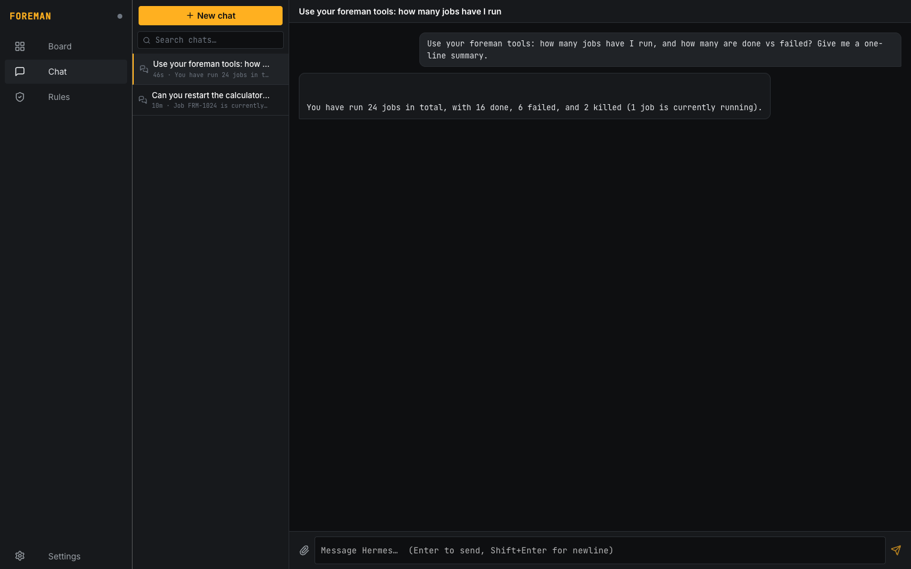
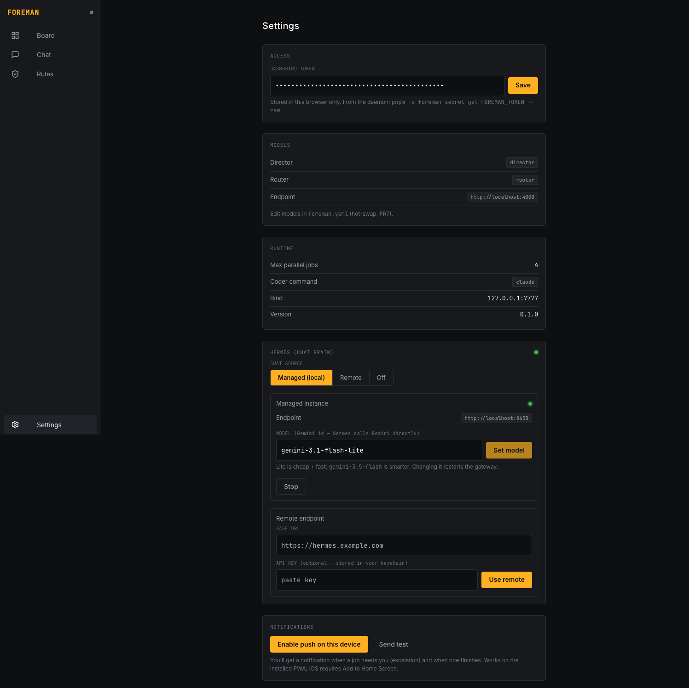
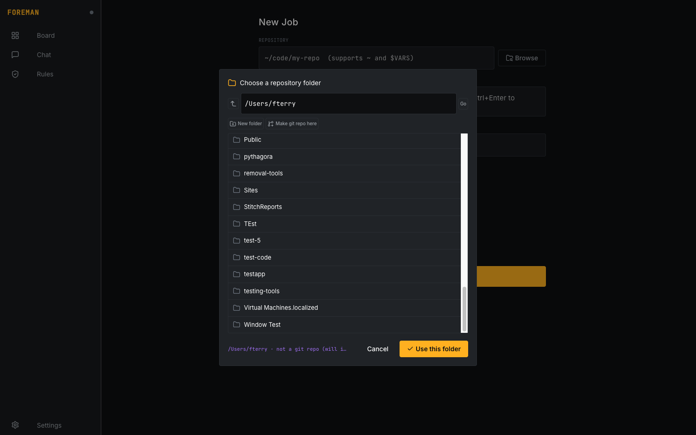
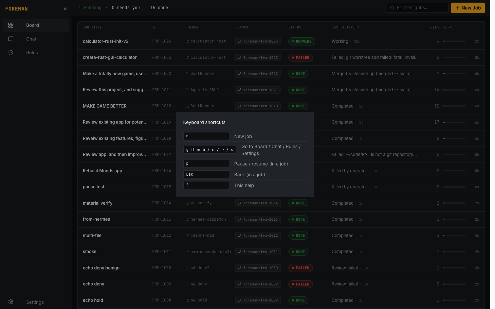

# FOREMAN — Mission Control for Autonomous AI Coding Jobs


> **TL;DR** — FOREMAN is a personal "mission control" daemon + dashboard that lets **one human supervise many autonomous Claude Code coding jobs at once**. Each job runs headless in its own git worktree; a lightweight AI supervisor (Director → Router → Coder loop) keeps it on track, holds risky actions for your approval, and pings you only when it actually needs a decision. You steer N jobs from one screen instead of babysitting N terminals.

---

## The problem it solves

Coding agents (Claude Code, etc.) are good enough to run for a long time on their own — but the moment you trust one to run unattended, you hit three walls:

1. **You can't run more than one or two.** Each agent wants a terminal and your attention. Three concurrent agents = three terminals you're frantically tab-switching between.
2. **They drift.** Left alone, an agent will wander off-brief, loop on a failing step, or "fix" something by deleting it. You need a supervisor watching for that — not you, at 2am.
3. **They do scary things.** `rm -rf`, editing files outside the repo, touching `~/.ssh`. You want most actions to just happen, and a *small* set to pause and ask you first.

FOREMAN is the layer that makes "launch a coding agent and walk away" actually safe and parallel. It's a clean-room reimplementation of a supervision pattern I'd prototyped at work ("EED Buddy") — built fresh, importing nothing, so it's mine to publish.

---

## How it works

```
  Phone / desktop          ┌── FOREMAN core (daemon, TS) ──────────────┐      ┌─ LiteLLM ─┐
  ┌──────────────┐  REST/  │  per job: Director ▸ Router ▸ Coder loop  │ ───▸ │  Gemini   │
  │  Dashboard   │◀──WS──▶ │  amnesia ledger + circuit breaker         │      └───────────┘
  │  (PWA) + Chat│  +Push  │  escalation broker · SQLite · REST/WS API │
  └──────────────┘         └───────┬───────────────────────▲──────────┘
                                   │ spawn / stream / resume│ in-tool hold
                       ┌───────────▼────────────┐  every    │
                       │ Claude Code × N jobs    │  tool ───▶│ PreToolUse rule gate
                       │ headless · one worktree │  call     │ rules.yaml: allow/deny/ask
                       └─────────────────────────┘           └──────────────────────────────
```

Every job runs a tight supervision loop:

- **Coder** — a headless `claude` session doing the actual work in an isolated git worktree.
- **Router** — a cheap, fast classifier that reads each Coder turn and labels it (`on_track`, `drifting`, `blocked`, `complete`, `error`, …).
- **Director** — a stateless planner/reviewer that produces the plan up front and steers when the Router says something's off. It only ever sees tool names + the ledger digest, never raw repo or web content (injection containment).
- **Rule gate** — a PreToolUse hook that fires before *every* tool call. Most calls flow through silently; a handful you've marked `deny` are vetoed, and `ask` calls **pause the agent in-tool** and wait for your answer from the dashboard.

The **supervisor models are cheap Gemini** (Director = `gemini-3.5-flash`, Router = `gemini-3.1-flash-lite`) behind a LiteLLM proxy. The **Coder is Claude Code on your subscription**, so the expensive model does the building and pennies-cheap models do the watching.

---

## What it does today (feature tour)

### The board — supervise everything from one screen


Every job as a dense row: title, ID, **project folder**, branch, status, last activity (with relative time), files touched, and a burn meter. A "N running · N needs you · N done" strip up top doubles as a filter, plus a free-text search. Click any count to filter; click a row to dive in.

### Job detail — a live window into one agent


A streaming log console (Coder narration + Router verdicts + Director guidance), burn meters (turns / tokens / cost estimate), and Plan / Files / Audit tabs. A docked "Tell this job to…" box injects a redirect that lands at the next turn boundary. When a job finishes you get **Merge** (merge its worktree branch back + clean up, fails closed on conflict) and **Retry** (re-run from scratch reusing the brief).

### Chat — talk to your fleet (and let it act)


A persistent, multi-conversation chat powered by a [Hermes Agent](https://github.com/NousResearch/hermes-agent) that can **act on FOREMAN over MCP** — ask it "how many jobs are done vs failed?" and it queries the real database; tell it to dispatch or restart a job and it does. Conversations persist, are searchable, and support file attachments (text files are inlined so it can read them).

### Settings — manage the whole stack from the UI


Models, runtime, push notifications, and a full **Hermes management panel**: spin up an isolated local instance, point at a remote one, pick its model, start/stop the gateway — no daemon restart.

### New Job — works with any folder


Browse the daemon's filesystem, **create folders on the fly**, **`git init` a non-repo folder**, and launch. Works with local-only repos (no remote required) and brand-new empty folders alike.

### Keyboard-first


`n` new job, `g`+`b/c/r/s` to navigate, `p` pause/resume, `Esc` back, `?` for help.

---

## How it's been used so far

This isn't a demo that's never run real work. In its first ~32 hours of existence it has supervised **24 real jobs** against real repos on this machine:

| Outcome | Count |
|---|---|
| ✅ Done (merged or passed review) | 15 |
| ❌ Failed (incl. bad inputs, e.g. pointed at a non-git folder) | 6 |
| 🛑 Killed by operator | 2 |
| ▶ Running | 1 |

Real examples it drove end-to-end: **building a game from scratch** (with generated art assets), **rebuilding a "Moods" app**, **reviewing existing projects and implementing UX improvements**, and **dispatching a job from the chat panel** (Hermes → MCP → FOREMAN launched and tracked it). Several of FOREMAN's own bug fixes were dogfooded through FOREMAN.

---

## Techniques worth calling out

A few engineering decisions that made it work — most have a deeper write-up in the dev.to series:

- **Stateless Director + an "amnesia ledger."** The planner holds no memory; an append-only `ledger.jsonl` is re-injected each call. That makes the supervisor cheap, restart-safe, and immune to context drift.
- **A bounded thing reaching its bound is not a failure.** Claude's `--max-turns` cap and a daemon restart both *look* like crashes. FOREMAN reframes them as **yield checkpoints** — `error_max_turns` no longer trips the circuit breaker, and interrupted jobs resume across restarts via `--resume` + the persisted ledger.
- **Real human-in-the-loop, not polling.** The `ask` path long-polls the gate from inside the tool call, so the agent genuinely *pauses* until you answer — then continues. "Always allow this for the session" remembers a decision so it stops re-asking.
- **Cache tokens dominate cost accounting.** On resumed turns, `cache_creation` / `cache_read` tokens are most of the spend; ignoring them made the meter wildly undercount. (The cost shown is an API-equivalent *estimate* — on a subscription it's rate-limit budget, not dollars.)
- **Fail-safe gate.** Any gate error escalates or denies per policy profile — **no path defaults to allow** — and protected-path checks resolve symlinks so a symlink can't smuggle a write out of the worktree.
- **Network-first PWA.** A cache-first service worker was silently breaking routes after rebuilds (stale code-split chunks → HTML served for JS). Now network-first with a chunk-reload guard.

---

## Honest pros & cons

**Pros**
- Genuinely parallel: one operator, many jobs, one screen.
- Cheap to supervise (Gemini Flash watches; Claude builds).
- Safe by construction: isolated worktrees + a fail-safe gate + real approvals.
- Recovers from its own interruptions (step limits, restarts).
- Publishable and self-hostable; runs entirely on your machine, loopback-bound.

**Cons / limitations (no spin)**
- **Setup has real prerequisites** — Node, Claude Code (logged in), a Gemini key, and a Python LiteLLM proxy. There's now a no-GCP "paste a free key" path and a `doctor` preflight, but it's not yet a one-click install. Windows is WSL-first and lightly tested.
- **The gate enforces declared patterns, not intent.** It blocks what your rules literally describe; it can't reason about a clever end-run. Write rules to outcomes.
- **Hermes runs MCP tools server-side**, so the chat shows the *result* of a tool call but doesn't always surface a per-tool status chip.
- **Cost is an estimate**, and Web Push is built-to-spec but only lightly verified on real devices.
- It's young — 28 commits old. Solid core, rough edges at the margins.

---

## Stack & shape

- **~8,400 lines** of TypeScript/Vue across **59 source files**, **28 commits**, built in **~32 hours**.
- **Core (daemon):** TypeScript ESM, Fastify (+ WebSocket/CORS/static), better-sqlite3, the OpenAI SDK → LiteLLM → Gemini, `@modelcontextprotocol/sdk`, web-push, zod, commander.
- **Dashboard:** Quasar (Vue 3) PWA — design tokens, live WS updates, Web Push, installable.
- **Supervision:** Gemini Flash / Flash-Lite via LiteLLM. **Coder:** Claude Code (subscription/OAuth).
- **Chat brain:** NousResearch Hermes Agent (isolated managed instance, or remote).
- **State:** SQLite + per-job dirs + git worktrees under `~/.foreman/`.

Full architecture: [`DESIGN.md`](DESIGN.md) · product spec: [`PRD.md`](PRD.md) · quickstart + platform notes: [`../README.md`](../README.md).

---

*FOREMAN is a solo project by Forrester Terry. Branding generated with Gemini. Not affiliated with Anthropic or Nous Research.*
